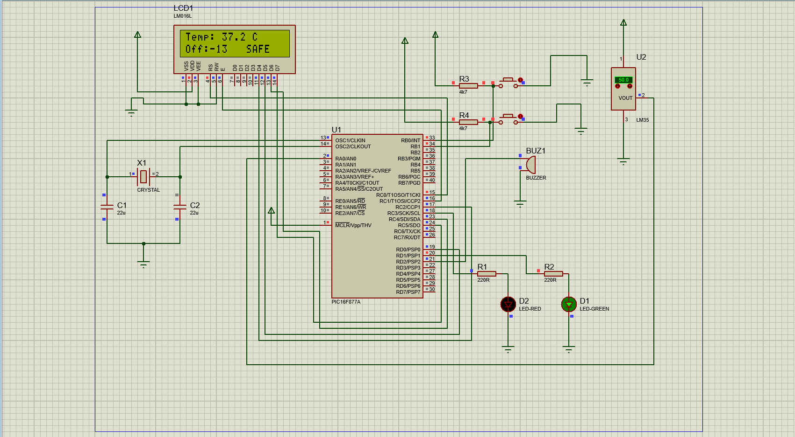
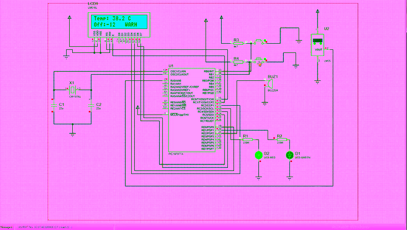

# PIC16F877A_Smart_Temperature_Monitor
# Smart Temperature Monitoring System with Dynamic Offset

## 📌 Project Overview
Hệ thống giám sát và cảnh báo nhiệt độ thời gian thực sử dụng vi điều khiển PIC16F877A. Dự án mô phỏng quá trình thu thập tín hiệu Analog từ cảm biến LM35, xử lý toán học để hiển thị lên LCD 16x2 và điều hướng logic cảnh báo ngoại vi (LED/Buzzer). Nổi bật với tính năng cho phép người dùng can thiệp và hiệu chỉnh nhiệt độ (Offset) trực tiếp qua nút nhấn vật lý.

## 🛠️ Hardware & Tools
* **Microcontroller:** PIC16F877A (8-bit)
* **Sensor:** LM35 (Analog Temperature Sensor)
* **Display:** LCD 16x2 (Hitachi HD44780 controller)
* **IDE & Compiler:** MPLAB X IDE, XC8 Compiler
* **Simulation:** Proteus Design Suite

## 🚀 Key Technical Achievements (Các vấn đề kỹ thuật đã giải quyết)

### 1. Triệt tiêu lỗi Read-Modify-Write (RMW) bằng Block Write
Dòng vi điều khiển PIC16 không hỗ trợ thanh ghi chốt (LAT registers), dẫn đến hiện tượng RMW khi xuất tín hiệu tần số cao ra các chân LCD, làm méo mó dữ liệu giao tiếp do điện dung ký sinh. 
* **Giải pháp:** Thiết kế lại driver điều khiển LCD từ việc xuất từng bit (Bit-banging) sang kỹ thuật **Block Write** (đẩy nguyên khối 8-bit ra PORTC). Điều này đảm bảo tính toàn vẹn của tín hiệu điều khiển trên Bus dữ liệu.

### 2. Tối ưu hóa Bộ nhớ với Toán học Số nguyên (Fixed-Point Math)
Trình biên dịch XC8 tốn rất nhiều dung lượng ROM/RAM để xử lý thư viện số thực (`float`), đồng thời dễ gây lỗi tràn bộ đệm khi hiển thị `sprintf`.
* **Giải pháp:** Loại bỏ hoàn toàn `float`. Áp dụng kỹ thuật Fixed-Point Math: Nhân tỷ lệ điện áp với hệ số nguyên lớn (`adc_value * 488 / 100`) để tính toán nội bộ, sau đó dùng phép chia lấy nguyên/dư để tách phần thập phân hiển thị lên LCD. Giảm thiểu tài nguyên tiêu thụ và tăng tốc độ xử lý luồng.

### 3. Kỹ thuật Debouncing Nút nhấn
Áp dụng logic phần mềm kết hợp bộ định thời trễ (`__delay_ms`) và vòng lặp chờ trạng thái (State Polling) để triệt tiêu hiện tượng dội phím cơ học, đảm bảo biến Offset được hiệu chỉnh chính xác từng đơn vị.

## 📸 System Schematic & Demo

**1. Normal Operation (Trạng thái An toàn - Đèn xanh)**

**2. Overheat Alert (Trạng thái Cảnh báo - Đèn đỏ & Còi)**

**3. Real-time Operation Demo (Mô phỏng thay đổi Offset và Nhiệt độ)**

## 📁 Repository Structure
* `/src`: Chứa mã nguồn nhúng viết bằng C.
* `/simulation`: Chứa bản thiết kế Proteus và file hex đã biên dịch.
